# Lagersystem

Ein Spring-Boot-Backend zur Verwaltung von Lebensmitteln, Einkaufsläden, Rezepten und Haushaltsvorräten. Das System kann speichern, welche Lebensmittel in welchen Einkaufsläden erhältlich sind, welche Lebensmittel im Haushalt verfügbar sind und welche Rezepte anhand des aktuellen Vorrats gekocht werden können.

## Inhaltsverzeichnis

- [Features](#features)
- [Technologien](#technologien)
- [Architekturüberblick](#architekturüberblick)
- [Datenmodell / ERM](#datenmodell--erm)
- [Authentifizierung und Rollen](#authentifizierung-und-rollen)
- [API-Überblick](#api-überblick)
- [Lokales Setup](#lokales-setup)
- [Konfiguration](#konfiguration)
- [Beispiel: Auth-Flow](#beispiel-auth-flow)
- [Hinweise zur Weiterentwicklung](#hinweise-zur-weiterentwicklung)

## Features

- Verwaltung von Kategorien, Lebensmitteln und Einkaufsläden
- Zuordnung von Lebensmitteln zu Einkaufsläden inklusive Preis
- Verwaltung von Rezepten und benötigten Zutaten
- Verwaltung verfügbarer Lebensmittel im Haushalt inklusive Bestand und Mindestbestand
- Ermittlung kochbarer Rezepte anhand des aktuellen Vorrats
- Ausführen eines Kochvorgangs, bei dem der Bestand reduziert wird
- JWT-basierte Authentifizierung mit Bearer Token
- Rollenbasierte Autorisierung, z. B. Admin-Rechte für schreibende Operationen
- Swagger/OpenAPI-Dokumentation für lokale Tests

## Technologien

Das Projekt basiert auf einem klassischen Spring-Boot-REST-Backend.

| Technologie | Zweck |
|---|---|
| Java 17 | Programmiersprache / Laufzeitumgebung |
| Spring Boot | Backend-Framework |
| Spring Web | REST-Controller und HTTP-Endpunkte |
| Spring Data JPA | Repository-Schicht und Datenbankzugriff |
| Hibernate | JPA-Implementierung und ORM-Mapping |
| PostgreSQL | Relationale Datenbank |
| Spring Security | Authentifizierung und Autorisierung |
| OAuth2 Resource Server | Validierung von Bearer/JWT Tokens |
| JWT | Token-basiertes Login ohne serverseitige Session |
| Lombok | Reduktion von Boilerplate-Code |
| Jakarta Bean Validation | Validierung von DTOs und Entity-Feldern |
| Springdoc OpenAPI / Swagger UI | API-Dokumentation und manuelles Testen |
| Maven | Build- und Dependency-Management |
| Actuator | Basis-Monitoring und Health-Endpoint |

## Architekturüberblick

Das Projekt ist in typische Spring-Schichten aufgeteilt:

```text
controller  -> REST-Endpunkte, HTTP-Status, Request/Response
service     -> Fachlogik, Transaktionen, Validierung, Orchestrierung
repository  -> Datenbankzugriff über Spring Data JPA
entity      -> JPA-Entities und Datenmodell
dto         -> Eingabe- und Ausgabeobjekte der API
security    -> Authentifizierung, JWT, User, Rollen, Security-Konfiguration
error       -> zentrale Fehlerobjekte und fachliche Exceptions
model       -> interne Ergebnis-/Hilfsmodelle, z. B. Bestandsprüfung
```

Die Service-Schicht enthält die zentrale Fachlogik. Controller sollten möglichst dünn bleiben und keine Datenbanklogik enthalten.

## Datenmodell / ERM

Das folgende Modell zeigt die Kernbeziehungen der Datenbank. Die Join-Entities `EINKAUFSLADEN_LEBENSMITTEL` und `REZEPT_LEBENSMITTEL` sind eigene fachliche Tabellen, weil sie zusätzliche Attribute wie `preis` bzw. `menge` enthalten.

```mermaid
erDiagram
    KATEGORIE ||--o{ LEBENSMITTEL : kategorisiert
    LEBENSMITTEL ||--o{ EINKAUFSLADEN_LEBENSMITTEL : ist_erhaeltlich_als
    EINKAUFSLADEN ||--o{ EINKAUFSLADEN_LEBENSMITTEL : fuehrt
    REZEPT ||--o{ REZEPT_LEBENSMITTEL : besteht_aus
    LEBENSMITTEL ||--o{ REZEPT_LEBENSMITTEL : wird_verwendet_in
    LEBENSMITTEL ||--o| VERFUEGBARE_LEBENSMITTEL : hat_bestand

    KATEGORIE {
        int kategorie_id PK
        string name UK
    }

    LEBENSMITTEL {
        int lebensmittel_id PK
        string name
        int kategorie_id FK
    }

    EINKAUFSLADEN {
        int einkaufsladen_id PK
        string name UK
    }

    EINKAUFSLADEN_LEBENSMITTEL {
        int einkaufsladen_lebensmittel_id PK
        int einkaufsladen_id FK
        int lebensmittel_id FK
        decimal preis
    }

    REZEPT {
        int rezept_id PK
        string beschreibung
        string bild
        int leckerheitsskala
        int dauer
        int personen
    }

    REZEPT_LEBENSMITTEL {
        int rezept_lebensmittel_id PK
        int rezept_id FK
        int lebensmittel_id FK
        string menge
    }

    VERFUEGBARE_LEBENSMITTEL {
        int verfuegbare_lebensmittel_id PK
        int lebensmittel_id FK
        int anzahl
        int threshold
    }

    APP_USER {
        int user_id PK
        string user_name UK
        string email UK
        string password_hash
        string role
    }
```



### Wichtige Constraints

- `Einkaufsladen.name` ist eindeutig.
- `Kategorie.name` ist eindeutig.
- `User.email` und `User.userName` sind eindeutig.
- `EinkaufsladenLebensmittel` sollte die Kombination aus `einkaufsladen_id` und `lebensmittel_id` eindeutig halten.
- `RezeptLebensmittel` sollte die Kombination aus `rezept_id` und `lebensmittel_id` eindeutig halten.
- `VerfuegbareLebensmittel` sollte pro Lebensmittel maximal einen Bestandsdatensatz besitzen.

Diese Constraints sind wichtig, weil sie doppelte oder widersprüchliche Daten auch dann verhindern, wenn mehrere Requests parallel eintreffen.

## Authentifizierung und Rollen

Die API nutzt JWT-basierte Authentifizierung.

1. Ein User registriert sich über `/auth/register`.
2. Ein User loggt sich über `/auth/login` ein.
3. Der Server gibt einen JWT Access Token zurück.
4. Geschützte Requests müssen den Token als Bearer Token mitsenden:

```http
Authorization: Bearer <accessToken>
```

### Rollen

Aktuell sind folgende Rollen vorgesehen:

| Rolle | Bedeutung |
|---|---|
| USER | Darf Daten lesen und fachliche Aktionen ausführen, sofern erlaubt |
| ADMIN | Darf zusätzlich schreibende oder löschende Operationen ausführen |

Schreibende Endpunkte wie `POST`, `PUT`, `PATCH` und `DELETE` sollten langfristig konsequent mit Admin-Rechten geschützt werden.

## API-Überblick

Die genauen Endpunkte sind über Swagger erreichbar:

```text
http://localhost:8080/swagger-ui/index.html#/
```

Typische Endpunkte:

| Methode | Pfad | Beschreibung |
|---|---|---|
| POST | `/auth/register` | Neuen User registrieren |
| POST | `/auth/login` | Login und JWT erhalten |
| GET | `/kategorie` | Alle Kategorien abrufen |
| POST | `/kategorie` | Kategorie erstellen |
| GET | `/lebensmittel` | Alle Lebensmittel abrufen |
| POST | `/lebensmittel` | Lebensmittel erstellen |
| GET | `/einkaufsladen` | Alle Einkaufsläden abrufen |
| POST | `/einkaufsladen` | Einkaufsladen erstellen |
| GET | `/einkaufsladenlebensmittel` | Laden-Lebensmittel-Zuordnungen abrufen |
| POST | `/einkaufsladenlebensmittel` | Lebensmittel einem Laden mit Preis zuordnen |
| GET | `/rezept` | Alle Rezepte abrufen |
| POST | `/rezept` | Rezept erstellen |
| GET | `/verfügbarelebensmittel` | Aktuellen Vorrat abrufen |
| POST | `/verfügbarelebensmittel` | Bestand anlegen |
| DELETE | `/verfügbarelebensmittel/{id}` | Bestand löschen |
| GET | `/kochen` | Kochbare Rezepte anhand des Vorrats abrufen |
| POST | `/kochen/{rezeptId}` | Rezept kochen und Bestand reduzieren |

## Lokales Setup

### Voraussetzungen

- Java 17
- Maven
- PostgreSQL
- IDE wie IntelliJ IDEA oder VS Code

### Projekt starten

```bash
mvn spring-boot:run
```

Alternativ kann das Projekt direkt über die Main-Klasse gestartet werden:

```text
LagersystemApplication
```

## Konfiguration

Beispielhafte lokale Konfiguration in `application.properties`:

```properties
spring.datasource.url=jdbc:postgresql://localhost:5432/lagersystem
spring.datasource.username=postgres
spring.datasource.password=postgres

spring.jpa.hibernate.ddl-auto=update
spring.jpa.show-sql=true
spring.jpa.properties.hibernate.format_sql=true

security.jwt.secret=please-change-this-secret-and-use-at-least-32-characters
security.jwt.expiration-minutes=60
```

Das JWT-Secret sollte nicht produktiv im Repository liegen. Für echte Deployments sollte es über Umgebungsvariablen oder Secret-Management bereitgestellt werden.

## Beispiel: Auth-Flow

### Registrierung

```http
POST /auth/register
Content-Type: application/json

{
  "userName": "admin",
  "email": "admin@example.com",
  "password": "Test123"
}
```

### Login

```http
POST /auth/login
Content-Type: application/json

{
  "email": "admin@example.com",
  "password": "Test123"
}
```

Beispielhafte Antwort:

```json
{
  "accessToken": "<jwt-token>",
  "tokenType": "Bearer",
  "expiresAt": "2026-07-06T19:43:44Z",
  "role": "USER"
}
```

### Geschützten Endpunkt aufrufen

```http
GET /einkaufsladen
Authorization: Bearer <jwt-token>
```


## Projektstatus

Das Projekt ist ein Lern- und Praxisprojekt zur Vertiefung von Spring Boot, JPA, REST-APIs, Datenmodellierung und JWT-basierter Security.
